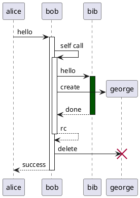
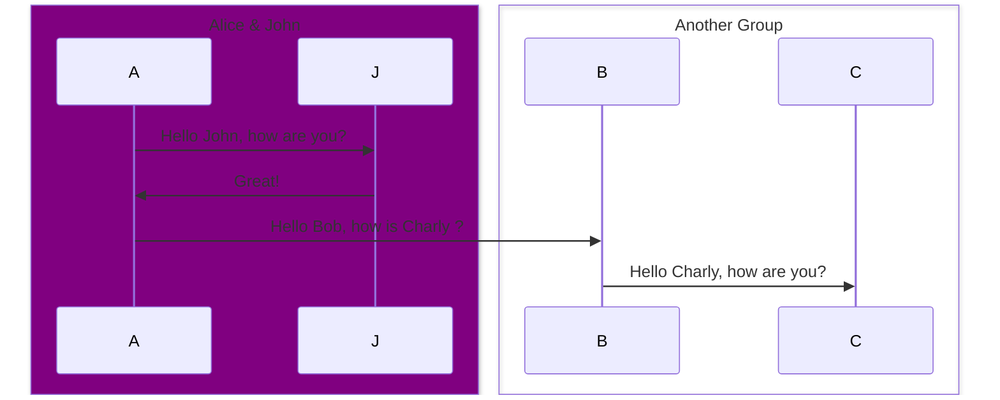

# test-md-uml

```puml
@startuml
alice -> bob ++ : hello
bob -> bob ++ : self call
bob -> bib ++  #005500 : hello
bob -> george ** : create
return done
return rc
bob -> george !! : delete
return success
@enduml
```

```mermaid
sequenceDiagram
    box Purple Alice & John
    participant A
    participant J
    end
    box Another Group
    participant B
    participant C
    end
    A->>J: Hello John, how are you?
    J->>A: Great!
    A->>B: Hello Bob, how is Charly ?
    B->>C: Hello Charly, how are you?
```
